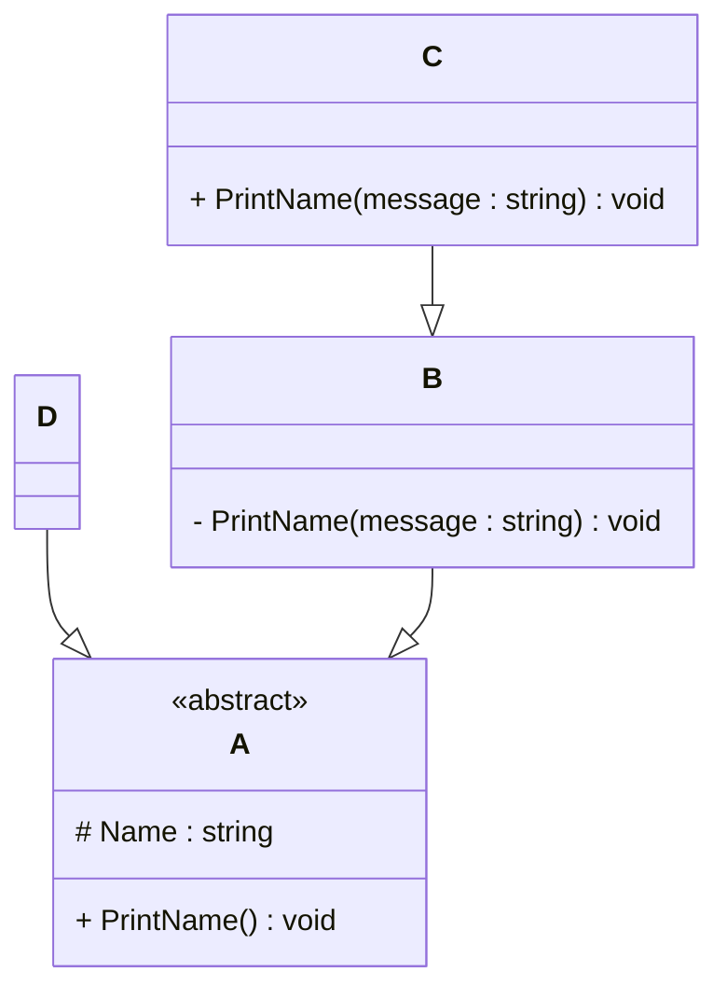

# Programming Test

This test was composed to create a general overview of your knowledge regarding general programming and how it fits with the needs in our lab. Please try to answer all questions using your own knowledge and in your own words. If you get stuck on one of the exercises, still try to give a short answer.

---

## Exercise 1

### Task
Write a program in the language of your choice where:

1. The iteration number (starting from 1), followed by a random number between 1 and 100, is printed 100 times.
Solution:-
import java.util.ArrayList;
import java.util.Collections;
import java.util.List;

public class UniqueRandomNumberPrinter {

 public static void main(String[] args) {
        // Create a Random object to generate random numbers
        List<Integer> numb = new ArrayList<>();
        for (int i = 1; i <= 100; i++) {
            numb.add(i); 
        }

  Collections.shuffle(numb); 

System.out.println("Unique numb:");
	// Generating random numbers.
        for (int i = 0; i < numb.size(); i++) {
            System.out.printf("%3d: %3d%n", i + 1, numb.get(i));
        }
    }
}

3. After every 5 iterations, write an additional separator (e.g., `---`).
   solution:
   import java.util.Random;

    public class RandomNumberPrinter {

     public static void main(String[] args) {

    // We're using Java's Random class here to produce pseudorandom numbers.
        // This will help us simulate unpredictable values between 1 and 100.
        Random random = new Random();
        System.out.println("Random numbers");

    for (int i = 1; i <= 100; i++) {
            int randomNumber = random.nextInt(100) + 1; // Adds 1 to ensure we get a number in the range [1, 100], since nextInt(100) gives 0–99.
            System.out.printf("%3d: %3d%n", i, randomNumber);

      // For better readability, insert a line break every 5 numbers.
            if (i % 5 == 0) {
                System.out.println("---");
            }
        }
    }

}

5. Write “Lucky number!” after every random number that is divisible by 7.
   import java.util.Random;

   public class RandomNumberPrinter {

    public static void main(String[] args) {

// We're utilizing Java's Random class here to generate pseudorandom numbers.
// This will assist us in emulating unpredictable values between 1 and 100.
        Random random = new Random();
        System.out.println("Random numbers");

for (int i = 1; i <= 100; i++) {
            int randomNumber = random.nextInt(100) + 1; // Adds 1 to ensure we get a number in the range [1, 100], since nextInt(100) gives 0–99.
            System.out.printf("%3d: %3d", i, randomNumber);
// If the number is divisible by 7, print a small surprise
            if (randomNumber % 7 == 0) {
                System.out.print("  Lucky number!");
}
            System.out.println();

 // For better readability, insert a line break every 5 numbers.
            if (i % 5 == 0) {
System.out.println("---");
            }
        }
    }

}

> Try to keep the procedure as short as possible.

---

## Exercise 2

### 1. **What is your understanding of the term “Design Patterns”?**  
   Provide a description in your own words.
   Designing Patterns are standard solutions to common software design problems. They're not completed code but instead best practice templates or blueprints 
   that can be tailored to meet specific programming contexts. Imagine them as successful methods for repeated design problems that help make code more flexible, 
   reusable, and maintainable.

### 2. **Explain the MVC Pattern**  
   - What does MVC stand for?
     MVC stands for Model-View-Controller. It is a software architectural pattern used to separate concerns in applications with user interfaces.

   - Explain the pattern in detail.
     Model: Implements the data and business logic of the application. It directly takes care of the data, logic, and rules of the application.

     View: Presents the data to the user. It is the UI layer that shows model data in some format.

     Controller: Is the middleman between the Model and View. It takes care of user input, processes it (sometimes using the model), and updates the view 
     accordingly.
     
   - What are some use cases for this framework?
     Web Applications: Frameworks such as Spring MVC (Java), Django (Python), and Ruby on Rails use MVC to process web requests and return views.

     Desktop Applications: Java Swing or.NET-based applications can be organized using MVC to decouple UI logic from business logic.

     Mobile Apps: iOS development (based on Cocoa MVC) and Android applications tend to use variations of MVC for handling UI.

### 3. **List three other design patterns**  
   - Provide names and details for three additional design patterns.
   - Explain how you have used those patterns in the past and how they have solved your problem  
   - Use diagrams to explain the design patterns.
     
     1. Singleton Pattern:-
     Description:-
     Guarantees a class has a single instance and supplies a global access point to it.

     How I used it:
     In a logging tool I created for a backend service, I employed the Singleton pattern to have all logs pass through a single instance of Logger. This avoided 
     resource conflicts and greatly simplified debugging
     Diagram:-
     +-----------------+
     |   Logger        |
     |-----------------|
     | - instance      | <---- static
     | + getInstance() | -----> Returning the same object every time.
     +-----------------+
     
     2. Observer Pattern:-
     Description:-
     Creates a one-to-many dependency between objects whereby when a single object (the subject) changes state, its dependents (observers) are all notified 
     automatically.
     How I used it:
     In a prototype of a chat application, I applied this pattern to inform all connected clients when a user posted a new message. Each client subscribed as an 
     observer to the server's message stream.
     Diagram:-
        +-----------+
        | Subject   |
        +-----------+
             |
         +----+----+
         |         |
      +------+  +-------+
      | Obs1 |  | Obs2  | <--- get notification  when Subject changes
      +------+  +-------+

      3. Factory Pattern:-
         Description:-
         Creates objects with no exposure to the client of the instantiation logic, by using a common interface.
         How I used it:-
         I applied the Factory pattern in a payment module to create various payment method objects (e.g., PayPal, CreditCard, UPI) based on user input. This 
         allowed the code to be scalable and simple to extend for new payment methods.
         +--------------------+
         | PaymentFactory     | ---> returns object on basis of input.
         +--------------------+
                   |
         ----------------------
         |         |          |
     +------+  +---------+ +-------+
     | UPI  |  | PayPal  | | Credit|
     +------+  +---------+ +-------+

---

## Exercise 3

### 1. **Implementation Task**  
   Based on the class diagram below, provide an implementation in any object-oriented programming language of your choice.
   

--- Here is Java implementation based on your class diagram:-----

package uni.wien;

// Abstract class A with protected Name and abstract method
public abstract class A {

    protected String Name;

    public A(String name) {
        this.Name = name;
    }

    public abstract void Printname();
}
--------------------------------------------------------------------------------
package uni.wien;

// B extends A and provides private method PrintName
public class B extends A {

    public B(String name) {
        super(name);
    }

    // Private method only accessible within B
    private void PrintName(String message) {
        System.out.println("Private in B: " + message);
    }

    @Override
    public void Printname() {
        PrintName(Name);  // Used internally
    }
}
-------------------------------------------------------------------------
package uni.wien;

// C extends B and adds its own public PrintName
public class C extends B {

    public C(String name) {
        super(name);
    }

    // Public version accessible outside
    public void PrintName(String message) {
        System.out.println("C says: " + message);
    }
}
-------------------------------------------------------------
package uni.wien;

// D extends A and directly implements Printname
public class D extends A {

    public D(String name) {
        super(name);
    }

    @Override
    public void Printname() {
        System.out.println("D says: " + Name);
    }
}
-----------------------------------------------------------------------
// Example usage
package uni.wien;

public class Abc {

    public static void main(String[] args) {

        D d = new D("passing object D");
        d.Printname();
        // Output: D says: passing object D

        B b = new B("passing object B");
        b.Printname();
        // Output: Private in B: passing object B

        C c = new C("passing object C");
        c.Printname(); // Inherited from B, uses B's private PrintName internally
        // Output: Private in B: passing object C

        c.PrintName("Hello from C");
        // Output: C says: Hello from C
    }
}

### 2. **Key Questions**  
   - Are you able to directly create a new instance of `ObjectA`? Please explain your answer.
     No, if ObjectA is abstract, it cannot be implemented directly.
      
   - Given an instance of `ObjectC`, are you able to call the method `PrintMessage` defined in `ObjectB`? Please explain your answer.
     Yes, if PrintMessage is not private, since  the ObjectC inherits from the ObjectB.
     
   - Try to explain as many key features of object-oriented programming as you can find in this example.
     Abstraction (via abstract classes)

     Inheritance (class hierarchy)

     Encapsulation (access control)

     Polymorphism (method overriding)

---

## Exercise 4

### Maintaining and Expanding Software for Component Validation

This exercise focuses on strategies for working with existing code bases and ensuring the software remains maintainable as new features and requirements are introduced.

### 1. **Working with Existing Code**  
- How would you approach understanding and contributing to an existing code base with minimal disruption?
  To learn and enhance an existing codebase with a minimal disruption, I would first read its documentation, investigate its code structure, execute the program, 
  and inspect using debuggers or logs for tracing execution prior to making slight, safe changes.  
- What practices would you follow to ensure your changes integrate well with the current structure?
  To make sure my changes fit in, I would keep to the current code style, write appropriate tests, be modular with modifications, test rigorously, and apply 
  proper version control and code reviewing for ease of collaboration.  

### 2. **Ensuring Maintainability**  
- What techniques would you use to keep the code base clean, modular, and easy to maintain as new features are added?
  To maintain the codebase clean, modular, and maintainable, I would apply methods such as separating concerns (e.g., MVC pattern), keeping to SOLID principles, 
  writing reusable and well-structured code, and using design patterns where necessary in order to control complexity when introducing new features.  
- How would you handle code documentation and testing to support long-term maintainability?
  To document code and testing, I would use best practices like writing precise comments, making use of Javadoc for public methods, building unit and integration 
  tests, and having good test coverage. These make the code easier to comprehend and give one confidence when updating the code later.
 

### 3. **Balancing Flexibility and Stability**  
- How would you design or refactor the software to make it flexible for future changes while ensuring the existing functionality remains stable?
  To make or refactor the software flexible and yet stable, I would make the code modular, adhering to separation of concerns, and utilize interfaces or abstract 
  classes to decouple pieces. I would also utilize version control to keep track of changes and achieve stability when introducing new features.
- Which design patterns or principles would you apply to achieve this balance
  Design patterns and principles such as Factory (for dynamic object creation), Strategy (for algorithm handling), Observer (for decoupled communication), and 
  Dependency Injection (for configurable flexibility) would assist in finding the balance between stability and flexibility. Moreover, adhering to SOLID 
  principles guarantees maintainability and stability without compromising the scalability or adaptability capability
---
