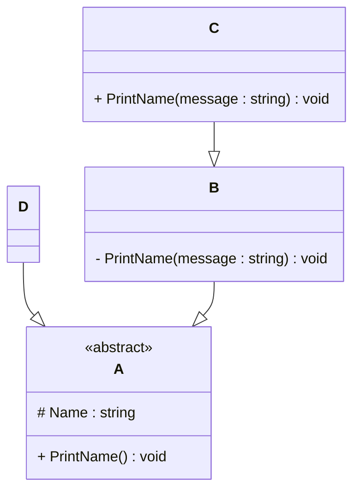

# Programming Test

This test was composed to create a general overview of your knowledge regarding general programming and how it fits with the needs in our lab. Please try to answer all questions using your own knowledge and in your own words. If you get stuck on one of the exercises, still try to give a short answer.

---

## Exercise 1

### Task
Write a program in the language of your choice where:

1. The iteration number (starting from 1), followed by a random number between 1 and 100, is printed 100 times.

//Java program that prints random number between 1 and 100.

import java.util.Random;

public class RandomNumberPrinter {

    public static void main(String[] args) {

        Random random = new Random();
        System.out.println("Random numbers");

        for (int i = 1; i <= 100; i++) {
            int randomNumber = random.nextInt(100) + 1; // Random number generated between 1 and 100
            System.out.println(i + ": " + randomNumber);
        }
    }

}

____________________________________________________________________________________________________________________

2. After every 5 iterations, write an additional separator (e.g., `---`).

import java.util.Random;

public class RandomNumberPrinter {

    public static void main(String[] args) {

        Random random = new Random();
        System.out.println("Random numbers");

        for (int i = 1; i <= 100; i++) {

            int randomNumber = random.nextInt(100) + 1; // Random number generated between 1 and 100
            System.out.println(i + ": " + randomNumber);

            if(i%5 == 0){
               System.out.println("--------") // Separator is added after every 5 numbers
            }

        }
    }
}

____________________________________________________________________________________________________________________

3. Write “Lucky number!” after every random number that is divisible by 7.

import java.util.Random;

public class RandomNumberPrinter {
    public static void main(String[] args) {
        Random random = new Random();
        
 
        for (int i = 1; i <= 100; i++) {
            
            int randomNumber = random.nextInt(100) + 1; // Random number generated between 1 and 100
            System.out.println( i + ": " + randomNumber);
            
            if(randomNumber % 7 == 0){
                System.out.println("Lucky number! " + randomNumber);
            }
            
        }
    }
}

---

## Exercise 2

### 1. **What is your understanding of the term “Design Patterns”?**  
   Answer : Professionally, Design patterns have been useful in improving the structure of code. In my experience, applying design patterns helped reduce unnecessary network calls and local database interactions in mobile app development, leading to smooth functionality of applications.

   Moreover, design patterns made communication among co-developers much easier. By using common terminology to refer to specific patterns.

### 2. **Explain the MVC Pattern**  

   - What does MVC stand for?  

   Answer : MVC stands for Model View Controller and it is an achitectural design pattern.

   - Explain the pattern in detail.  

   Answer :

    Model is responsible for handling data from Network calls (Ex: request and response) and database tables. Most of the busniess logic is implemented in model.

    View is responsible for displaying or updating data provided by the Model. Views mainly focuses on user interface and doesnt holds any logic.

    Controller acts as the communation connection between Model and the Views. It is responsible for inputs given by the user from Views, procress them and later updates to the model. 

   - What are some use cases for this framework?

   Answer : 

    In my professional experience i got chance to work on MVC in Android App Development, where Activites and Fragments are called as controllers, XML/Compose as Views and API calls, Databases, cache (repositories) as Models. For better app performance these pattern are very useful.
    

### 3. **List three other design patterns**  
   - Provide names and details for three additional design patterns.
   - Explain how you have used those patterns in the past and how they have solved your problem  
   - Use diagrams to explain the design patterns.

   Name : Singleton Pattern

   Details : Singleton makes sure that class has single instance and make sures that is globally accessed.

   Usage : I used singleton pattern for handling same instance in different screen of the app and made sure that same data is reflected in all screens.

   ----------------------
   |    Singleton       |
   |--------------------|
   | - instance         |
   | + getInstance()    |
   ----------------------

____________________________________________________________________________________________________________________

   Name : Observer Pattern

   Details : Observer Pattern responsible when one object changes its state, all its observers are called and updated automatically.

   Usage : In one of my developed Android applications, I used the Observer pattern with LiveData and ViewModel to automatically update the UI when the data changed, without manual refreshes and it is part of android architecture.

   -------------         -------------------
   |  Subject  |<>------>|     Observer    |
   -------------         -------------------
   | +addObserver()      | +update()       |
   | +notifyObservers()  |                 |
   -------------         -------------------

____________________________________________________________________________________________________________________

   Name : Factory Pattern

   Details : Factory pattern helps to create objects without exposing the creation logic to the client.

   Usage : I used the Factory pattern to create different types of API request handlers based on the service required.

            --------------------
            |  ApiService      |
            --------------------
                 ^         ^
                 |         |
--------------------   --------------------
|  AuthService     |   |  DataService     |
--------------------   --------------------

____________________________________________________________________________________________________________________
---

## Exercise 3

### 1. **Implementation Task**  
   Based on the class diagram below, provide an implementation in any object-oriented programming language of your choice.
   

-----------------------------------------------

--- Here is Java implementation based on your class diagram:-----

D --|> A
B --|> A
C --|> B

package uni.wien;

public abstract class A {
	
	protected String Name;

	public A(String name) {
		super();
		Name = name;
	}
	
	public abstract void Printname();

}

--------------------------------------------

package uni.wien;

public class B extends A {

	public B(String name) {
		super(name);
	}
	
	private void PrintName(String message) {
		System.out.println(message);
	}

	@Override
	public void Printname() {
		PrintName(Name);
	}

}

---------------------------------------------

package uni.wien;

public class C extends B {

	public C(String name) {
		super(name);
	}
	
	public void PrintName(String message) {
        System.out.println(message);
    }

}

------------------------------------------------
package uni.wien;

public class D extends A {

	public D(String name) {
		super(name);
		// TODO Auto-generated constructor stub
	}

	@Override
	public void Printname() {
		System.out.println(Name);
	}

}

---------------------------------

---Example Usage:---

package uni.wien;

public class Abc {
	
	public static void main(String[] args) {
	
		D d = new D("passing object D");
		d.Printname();
		// Output: passing object D
		
		B b = new B("passing object B");
		b.Printname();
		// Output: passing object B
		
		C c = new C("passing object C");
   
        c.PrintName();
        // Output: "Error"

        c.PrintName("Hello from C"); 
        // Output: Hello from C
		
	}
}

### 2. **Key Questions**  
   - Are you able to directly create a new instance of `ObjectA`? Please explain your answer.  

      Answer : No, A is declared as an abstract class and abstract classes cannot be instantiated directly and serve as template for subclasses

   - Given an instance of `ObjectC`, are you able to call the method `PrintMessage` defined in `ObjectB`? Please explain your answer.  

      Answer : B defines 'PrintName(String message)' as private method, which cannot be inherited by c.
               C defines its own public PrintName(String message), which is not related to B's private method.

   - Try to explain as many key features of object-oriented programming as you can find in this example.
   
      Answer : Key OOPs features are Abstraction,  Inheritance, Encapsulation, Polymorphism, Access Modifiers

---

## Exercise 4

### Maintaining and Expanding Software for Component Validation

This exercise focuses on strategies for working with existing code bases and ensuring the software remains maintainable as new features and requirements are introduced.

### 1. **Working with Existing Code**  
- How would you approach understanding and contributing to an existing code base with minimal disruption?  
- What practices would you follow to ensure your changes integrate well with the current structure?  

  Answer : I would first seek knowledge transfer from team members, especially designers and backend developers, then study the documentation, code structure, and key components like APIs and database interactions.

  I would run and debug the project to understand the flow, follow existing coding standards, implement or update unit tests, and carefully review the code to ensure seamless and safe integration.

### 2. **Ensuring Maintainability**  
- What techniques would you use to keep the code base clean, modular, and easy to maintain as new features are added?  
- How would you handle code documentation and testing to support long-term maintainability?

  Answer : To keep the codebase clean, I would focus on writing meaningful comments that explain the "why" behind the implementation, avoid code duplication, and maintain concise, readable code.

  For handling documentation and testing to support long-term maintainability, I would write clear comments for complex logic, maintain up-to-date README files for setup and usage, and ensure the project remains easy for new developers to understand and contribute.  

### 3. **Balancing Flexibility and Stability**  
- How would you design or refactor the software to make it flexible for future changes while ensuring the existing functionality remains stable?  
- Which design patterns or principles would you apply to achieve this balance

  Answer : To ensure a balance between flexibility and stability, I would use dependency injection to make components easily replaceable for testing or future upgrades, and apply small improvements to the codebase. The goal is to keep the code easy to change without breaking existing functionality.

  Additionally, depending on the requirements, I would apply design patterns such as Singleton, Observer, and Factory patterns to improve modularity and scalability.
---
