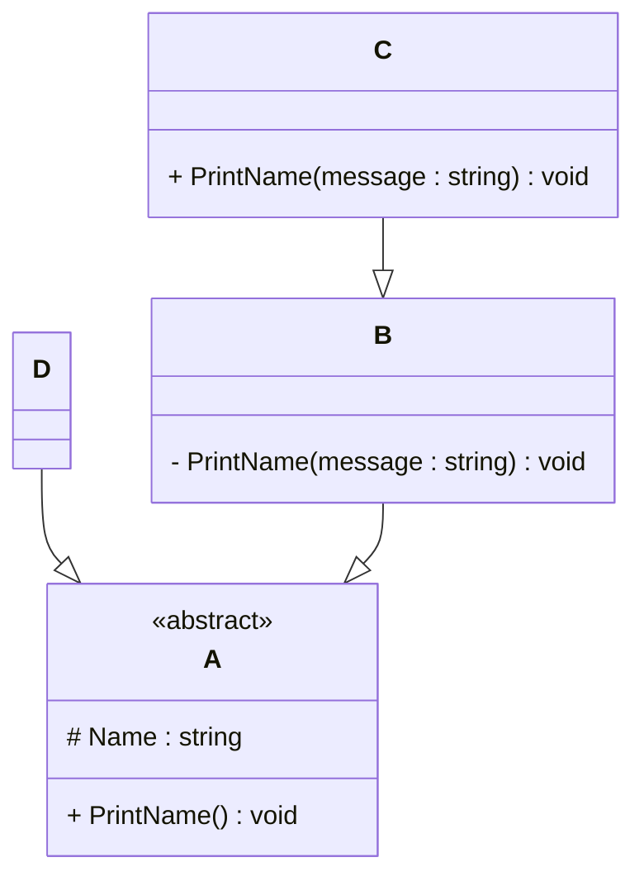

# Programming Test

This test was composed to create a general overview of your knowledge regarding general programming and how it fits with the needs in our lab. Please try to answer all questions using your own knowledge and in your own words. If you get stuck on one of the exercises, still try to give a short answer.

---

## Exercise 1

### Task
Write a program in the language of your choice where:

1. The iteration number (starting from 1), followed by a random number between 1 and 100, is printed 100 times.
2. After every 5 iterations, write an additional separator (e.g., `---`).
3. Write “Lucky number!” after every random number that is divisible by 7.

> Try to keep the procedure as short as possible.

---

### Solve (Python):

```{python}
import random

for i in range(1, 101):
    num = random.randint(1, 100)
    out = f'{i}: {num}'
    if num % 7 == 0:
        out += ' - Lucky number!'
    print(out)
    if i % 5 == 0:
        print('---')
```

   
## Exercise 2

### 1. **What is your understanding of the term “Design Patterns”?**  
   Provide a description in your own words.
### Solve:
The Design patterns are solutions to common software design programs, they are not a code as much as they are a footprints that guides the reader how to construct the code to solve specific problem in an efficient & flexible way.


### 2. **Explain the MVC Pattern**  
   - What does MVC stand for?  
   - Explain the pattern in detail.  
   - What are some use cases for this framework?

### Solve:
MVC is staning for (Model - View - Controller). It is mainly a software architicture that seperates the logic of the application into 3 components. which are: 
1. Model: Mainly responsible for handling interaction with the core of the software (whether with Backend or Database)
2. View: The User-interface part with is responsible of taking interactions from the user and viewing the requried output from the software to the user.
3. Controller: it is mainly a linkage that connect the Model with the View (Processing point of view)

There are various use cases for this architecture like: (Web frameworks - Desktop GUI - Mobile applications)

### 3. **List three other design patterns**  
   - Provide names and details for three additional design patterns.
   - Explain how you have used those patterns in the past and how they have solved your problem  
   - Use diagrams to explain the design patterns.

### Solve:
1. Factory Pattern: used in a machine learning framework to generate different types of classifiers (SVM, Random Forest, etc.) based on user input without modifying the core code.

 2. Observer Pattern: implemented in a sensor network simulation where each sensor node observed the environment and notified a central dashboard when specific thresholds were reached

3. Singleton Pattern: used in a Python app to ensure the logging system was centralized, avoiding duplicate log file handlers.

---

## Exercise 3

### 1. **Implementation Task**  
   Based on the class diagram below, provide an implementation in any object-oriented programming language of your choice.
   


### Solve: 
```{python}

class A(ABC):
    def __init__(self, name):
        self._name = name
    def PrintName(self):
        pass
class B(A):
    def __init__(self, name):
        super().__init__(name)
    def __PrintName(self, message):
        print(f"B (private): {message}")
class C(B):
    def __init__(self, name):
        super().__init__(name)

    def PrintName(self, message): 
        print(f"C (public): {message}")
class D(A):
    def __init__(self, name):
        super().__init__(name)
    def PrintName(self):
        print(f"D: {self._name}")
```

### 2. **Key Questions**  
   - Are you able to directly create a new instance of `ObjectA`? Please explain your answer. 

   - Given an instance of `ObjectC`, are you able to call the method `PrintMessage` defined in `ObjectB`? Please explain your answer. 
   - Try to explain as many key features of object-oriented programming as you can find in this example.


### Solve:
No, you cannot directly create an instance of class A because:

It's marked as abstract in the diagram (<<abstract>>), and In Python, we enforce this using the ABC metaclass and @abstractmethod decorator

### Solve:
 No, the method PrintName(message) in class B is private (indicated by __), which means it is not accessible from outside the class or by subclasses. however,, ObjectC defines its own public version of PrintName(message), which is the method that would be called.

### Solve:
Abstraction: Class A is abstract — it defines a method but doesn’t implement it.

Inheritance: Classes B, C, and D build on class A.

Encapsulation: Internal details like _name and __PrintName are hidden.

Polymorphism: PrintName works differently in each subclass.

Access Control: _name: protected and for __PrintName: private ,,, and PrintName: public in C and D


---

## Exercise 4

### Maintaining and Expanding Software for Component Validation

This exercise focuses on strategies for working with existing code bases and ensuring the software remains maintainable as new features and requirements are introduced.

### 1. **Working with Existing Code**  
- How would you approach understanding and contributing to an existing code base with minimal disruption?  

### Solve:
1. Initial Exploration: start with README, then the dependencies, then the call herarchies, mapping the whole code. Then try to deal with this code as a "BLACK BOX" and see what are the required inputs/outout from that box.

2. Test Code: local test the original code with some various critical input cases. Use some breakpoints and debuging tools to see the behaviour of the code and verify my understanding to that code.

3. Enhance or make the main task: Begin this step with a non-critital or isolated solution trying to add or enhance the critical points and may test them initialy privetly before publishing them.


- What practices would you follow to ensure your changes integrate well with the current structure?  

### Solve: 
1. Try as much as possible to follow the same stratigy that the code is written by.
2. adding effective comments, and more less more powerful comments.
3. try to add test cases and validation stuff for that code.


### 2. **Ensuring Maintainability**  
- What techniques would you use to keep the code base clean, modular, and easy to maintain as new features are added? 
### Solve: 
1. Follow the Single Responsibility Principle as each class should have one reason to change.

2. Try making common logic or functions needed in a shared utilites or base classes to avoind non-sense code statments,

3. Use consistent, well-defined interfaces between modules.


- How would you handle code documentation and testing to support long-term maintainability?  


### Solve:
 1. inline comments and notes  (Why-What-Where) for such a complex loginc
 2. good README file and comprehensive 
 3. for testing, may be Automated or AI testing based on the project and on the company criterias
 4. might share some other peers reviews if it requires to and without any restriction regrding that code.

### 3. **Balancing Flexibility and Stability**  
- How would you design or refactor the software to make it flexible for future changes while ensuring the existing functionality remains stable?  

### Solve:

1. Abstraction layers wiht a good detailed and maintained to make it easier to swap components later.
2. Making A versions API's to avoid breaking changes. 


- Which design patterns or principles would you apply to achieve this balance

### Solve:

There are many patterns, I will favor using after inishing "Test-Driven Development Strategy": Encourages modular, testable, and well-defined code from the start.


---
